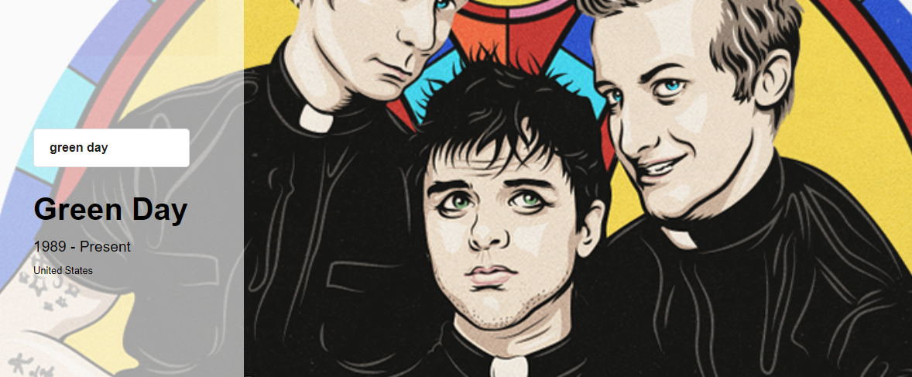

# BandSearch app using APIs (musicbrainz and google images)

#### Technologies used:

* HTML
* CSS
* JavaScript
* Sass
* Webpack
* Axios

*In order for this project to work correctly you must duplicate the file 'credentials.sample.js' change its name to credentials.js and insert your own credentials.*

        

